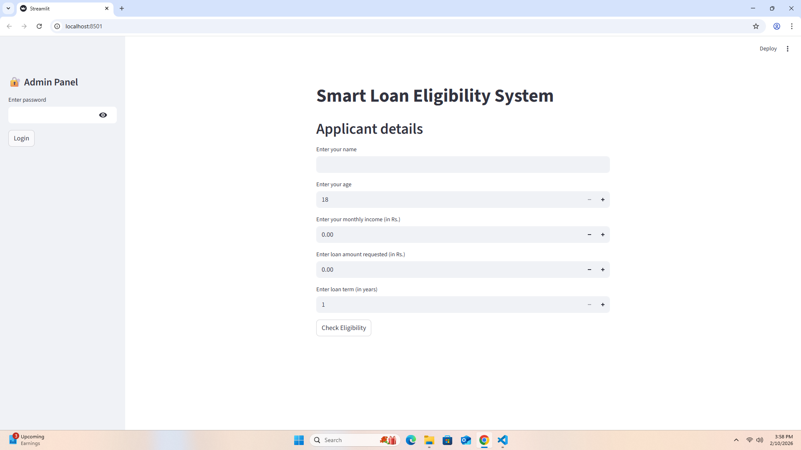
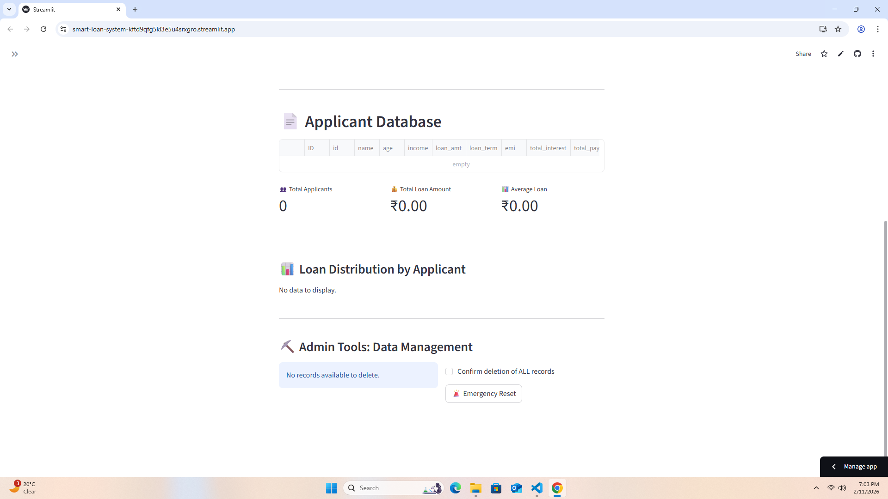
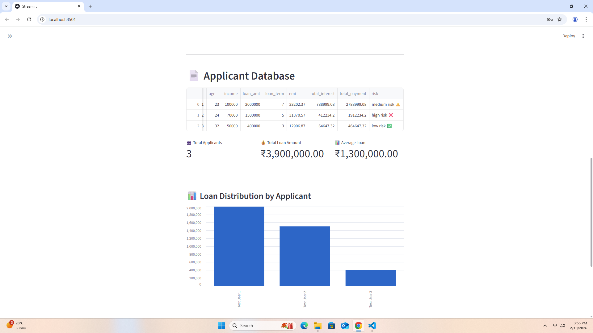
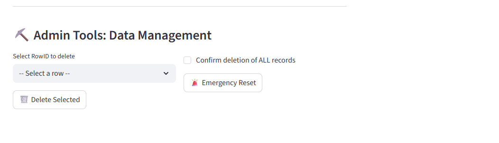

# 🏦 Smart Loan Eligibility  & Risk Assessment System

A professional **Loan Eligibility & Risk Assessment Web Application** built using **Python, Streamlit, and SQLite**.  
The application allows users to check loan eligibility, calculate EMI, assess financial risk, and provides a secure admin dashboard for monitoring and data management.

## ⚡ Quick Start (Recommended)

> For users who just want to run the app quickly.

1. Install **Python 3.9 or above**
2. Open terminal / command prompt inside the project folder
3. Run:
streamlit run app.py

The app will open automatically in your browser.

## 🚀 Features

### 👤 User Features
- Enter applicant details (Name, Age, Income, Loan Amount, Loan Term)
- Loan eligibility check based on predefined rules
- EMI calculation
- Total interest and total payment calculation
- Risk assessment (Low / Medium / High)
- Automatic storage of applicant data in SQLite database

### 🔐 Admin Panel Features
- Secure admin login using hashed password
- View applicant records in a structured table
- Dashboard metrics:
> Total applicants
> Total loan amount
> Average loan amount
- Loan distribution visualization
- Delete individual records
- Emergency reset option to delete all records

## 🧠 Risk Assessment Logic

The risk category is determined using:
1. **EMI-to-Income Ratio (DTI)** – highest priority
2. **Loan-to-Income Ratio (LTI)**
3. **Applicant Age (working years logic)**

### Risk Categories
- 🟢 Low Risk
- 🟡 Medium Risk
- 🔴 High Risk

## 🛠️ Tech Stack

- Python
- Streamlit
- SQLite
- Pandas
- Hashlib

## 📂 Project Structure

Loan Eligibility & Risk Assessment System/
│
├── app.py
├── loan_data.db
├── generate_admin_hash.py
├── README.md
│
├── pictures/
│   ├── admin_login.png
│   ├── admin_dashboard_empty.png
│   ├── applicant_table.png
│   └── data_management.png
│
└── .streamlit/
    └── secrets.toml

## 🖼️ Admin Panel Preview

The admin panel is **password-protected** and not accessible to normal users.  
The following screenshots are provided **only for demonstration purposes**.

### 🔐 Admin Login Screen
Secure login system using SHA-256 hashed password.

### 📊 Admin Dashboard Overview
Central dashboard displaying in empty state.

### 📄 Applicant Records Table
Central dashboard displaying structured table view of all loan applicants stored in SQLite database with metrics and chart.

### ⛏️ Admin Data Management Tools
Admin-only tools for deleting individual records or resetting the database.

> 🔒 **Security Note**  
> Admin access is restricted and protected. Screenshots are shown for portfolio visibility only.

## 🔐 Admin Password Configuration

The admin password is stored securely as a **SHA-256 hash**.

### Steps:
1. Generate password hash:
python generate_admin_hash.py

2. Copy the generated hash
3. Add it to `.streamlit/secrets.toml`:
ADMIN_PASSWORD_HASH = "your_generated_hash_here"

> Note: `secrets.toml` is never pushed to GitHub and remains private.

## ▶️ Detailed Local Setup (For Developers)

### Step 1: (Optional) Create a virtual environment
python -m venv venv

Activate it (Windows):
venv\Scripts\activate

### Step 2: Install dependencies
pip install streamlit pandas

### Step 3: Run the app
streamlit run app.py

## 💾 Database Information

- Database: **SQLite**
- File: `loan_data.db`
- Automatically created on first run
- Stores all applicant loan data locally

## 🌐 Cross-Browser Compatibility

The application is built using Streamlit, which follows modern web standards.  
It runs consistently across major browsers including:
- Google Chrome
- Microsoft Edge
- Mozilla Firefox
- Safari

No additional browser-specific configuration is required.

## 📌 Future Enhancements
- User authentication for personalized experiences.
- Integration with credit score APIs for more accurate risk assessment. 
- Addition of export options (CSV / Excel) for data portability.
- Cloud database support for scalability and remote access.

## 👨‍💻 Author

Developed by **Prateeksha Mishra**  
Built using Python & Streamlit ✨

